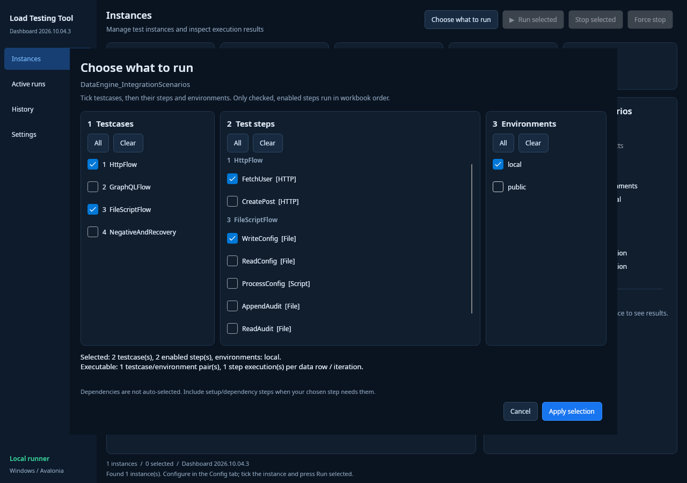
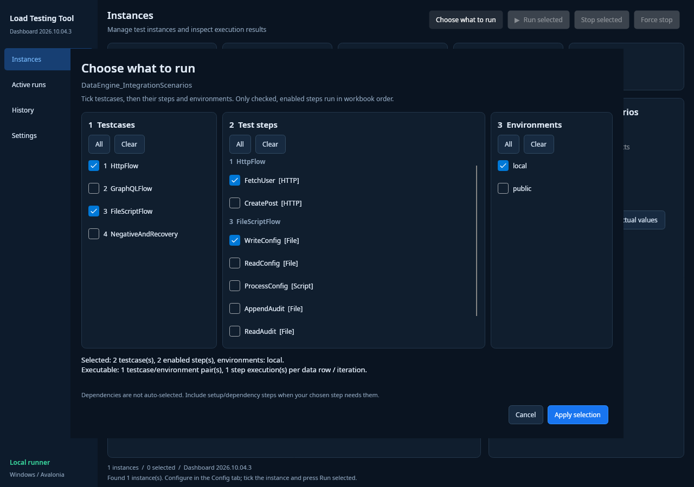
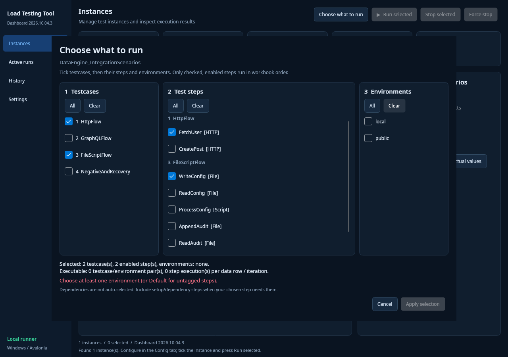

# Run Selection and System-Default Applications — Implementation Report

Date: 2026-10-04  
Build: **Dashboard 2026.10.04.3**

## Requested fixes completed

| Requirement | Implementation |
|---|---|
| Choose testcases | Named checkbox list loaded from the instance workbook |
| Choose test steps | Per-testcase named checkbox groups; disabled steps remain disabled |
| Choose environments | Named checkboxes based on the selected steps; explicit Default option for untagged steps |
| Execute only selected work | Runner receives testcase-scoped step JSON and explicit environment JSON, validates them, filters enabled steps and preserves workbook order |
| Open Excel/PDF/log/etc with default apps | All file/folder actions use the OS shell and its default associations; forced Excel/PDF/editor executable settings were removed |

The top toolbar now has **Choose what to run**. The Config tab also links to the picker. Apply automatically checks the instance for execution; **Run selected** starts it.

## Important behavior

- Empty testcase/step/environment choices disable Apply. Empty does not secretly mean Run all.
- The picker previews executable testcase/environment pairs and step counts before launch.
- Tagged steps execute only in matching selected environments; untagged steps apply to the selected environments.
- A testcase with no matching steps is not run for that environment.
- Setup/dependency steps are not added automatically.
- Applied choices are stored per instance in `.run-selection.json` and restored after restarting the app.
- Saved choices are explicit lists, including when all current options are checked. Adding workbook cases, steps or environment tags does not silently widen them.
- Instances without an applied/saved profile open the picker before their runner can start.
- Arguments are passed through `ProcessStartInfo.ArgumentList`, preserving spaces, quotes and punctuation.
- Legacy `ExcelApplicationPath`, `DocumentationApplicationPath`, and `LogApplicationPath` settings are ignored. Set file associations in OS settings.
- No complete-run timeout was added.

## Validation actually performed

### Build and automated checks

```bash
dotnet build LoadTestingTool.sln
dotnet run --project tests/SelectionRegression/SelectionRegression.csproj --no-build -- /home/ubuntu/TSLoadTestingTool
```

**Result: build succeeded; all 38 regression checks passed.** The test harness includes real runner subprocesses, not only selection-model checks.

Covered: ordered execution; testcase-scoped/case-insensitive names; disabled/unknown-step rejection; malformed and incomplete selection rejection; environment filtering and deduplication; default environment JSON; special characters in names; UI empty-selection validation; explicit saved-selection stability after workbook changes; system-default launcher settings for XLSX/PDF/log/JSON/text; real file-step side effects proving unselected work did not execute.

### Running desktop UI

The real Avalonia application was launched on the Sandbox Linux display and interacted with using native mouse/window controls.

1. Selected testcases **1 HttpFlow** and **3 FileScriptFlow**.
2. Selected only **FetchUser** and **WriteConfig**.
3. Selected only the **local** environment.
4. Preview showed one executable testcase/environment pair and one matching step.
5. The runner executed **WriteConfig only**: one request passed. Public-environment FetchUser did not execute.
6. Verified the saved profile contents and reopened the application; the same testcase, step and environment checkboxes were restored.
7. Cleared environments in the actual picker; it showed a validation error and disabled Apply.
8. Used a temporary, isolated XDG default-application association and clicked the app's file actions. The default handler received the input XLSX, history XLSX, PDF manual, UI log, runner internal log and Templates folder. Deliberately invalid legacy application executable paths did not override the defaults.

### Actual screenshots







These are screenshots of the running application, not generated mockups.

## Source changes

- `RunSelectionPlanner.cs`: strict ordered selection and environment filtering.
- `Program.cs` / `Models.cs`: runner selection contract and command-line integration.
- `RunSelectionModels.cs`: workbook metadata, draft selection, explicit snapshots.
- `RunSelectionWindow.cs`: named checkbox picker and executable preview.
- `MainWindow.cs` / `DashboardLayout.cs`: picker entry points, profile loading/saving, safe process arguments and OS-default actions.
- `SystemDefaultFileOpener.cs`: centralized OS shell dispatch.
- UI config and App config: removed forced-application settings.
- `tests/SelectionRegression`: repeatable regression checks, included in the solution.
- `UI_INSTANCE_MANAGER.md`: updated usage, selection semantics, flags and build instructions.
- Packaging script: distinct **2026.10.04.3** self-contained Windows x64 package with UI/Runner/Instances, build metadata and bundled runtime validation.

## Remaining limitations / future work

- Windows x64 binaries are cross-published from Linux. Windows-native rendering and the particular applications installed on your machine were not directly exercised here.
- Execution mode, testcase order and data-ID settings remain session-only; the new persisted profile covers the three requested selections.
- This is not dependency analysis: selecting a dependent step without its prerequisites can still fail. Choose its setup steps yourself.
- File launching requires a valid OS default association. Missing associations or app installation issues must be resolved in OS settings.
- A pre-existing NuGet warning remains for `Tmds.DBus.Protocol` 0.20.0 (GHSA-xrw6-gwf8-vvr9). Dependency upgrading is not included in this UI-fix scope.

## Using this build

Extract the **entire** `TSLoadTestingTool-Dashboard-2026.10.04.3-win-x64.zip` to a new folder and launch `UI/LoadTestingTool.UI.exe`. Confirm the sidebar reads **Dashboard 2026.10.04.3**. Do not reuse the old EXE or copy only the EXE. The package contains its runtime and does not require a separate .NET download.
