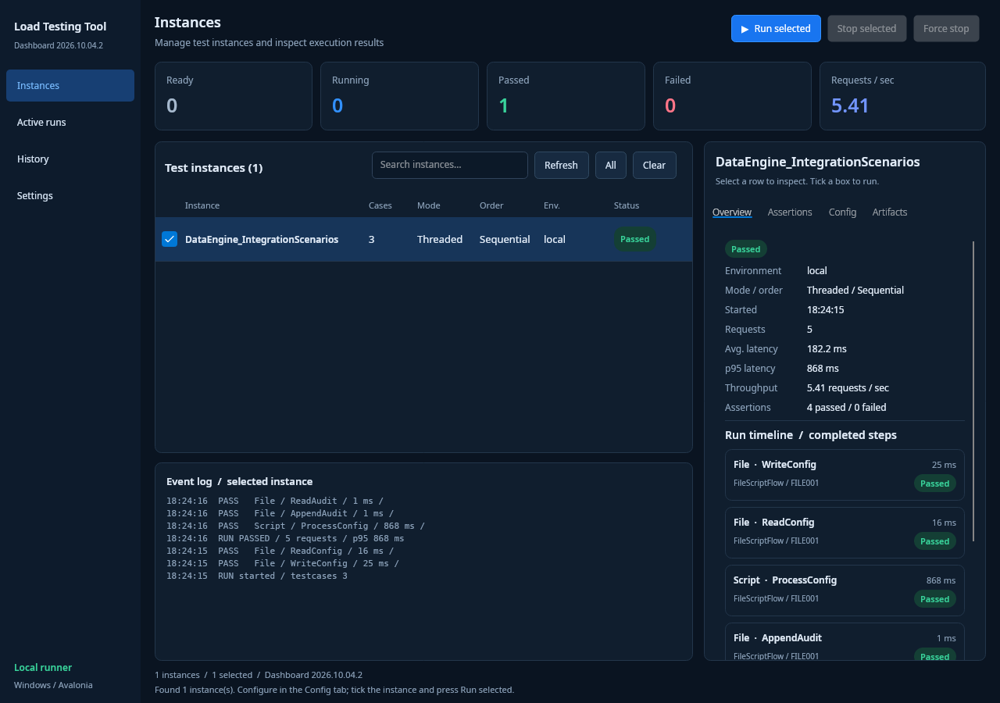
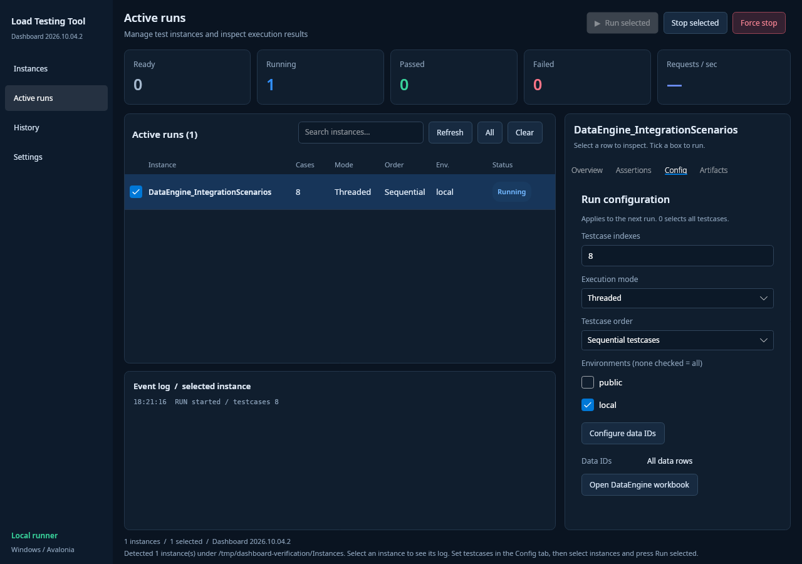
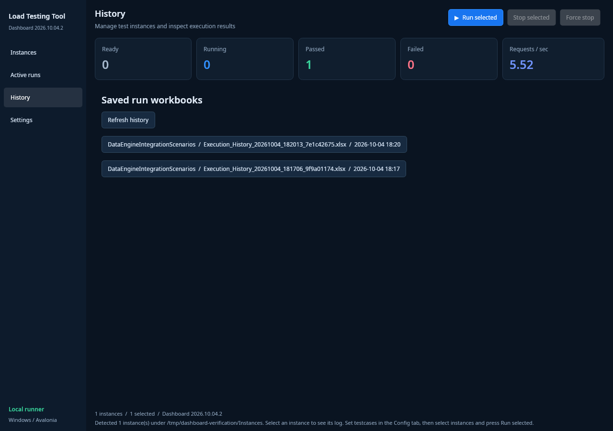
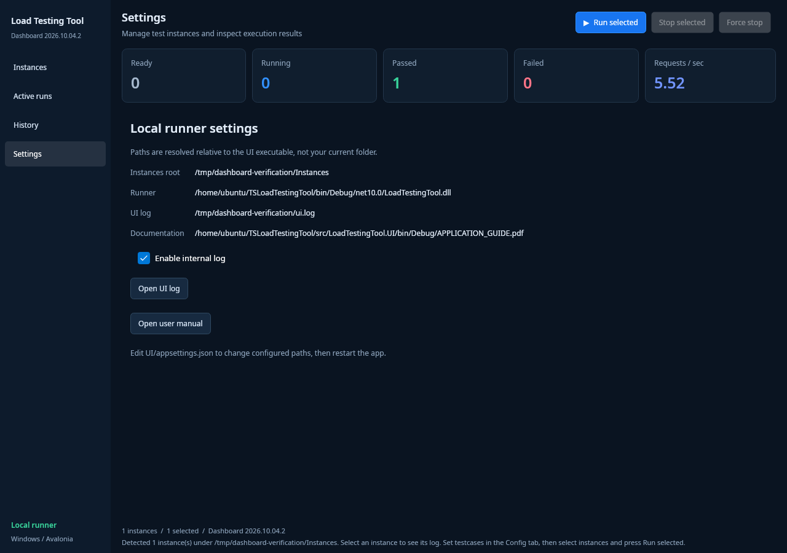
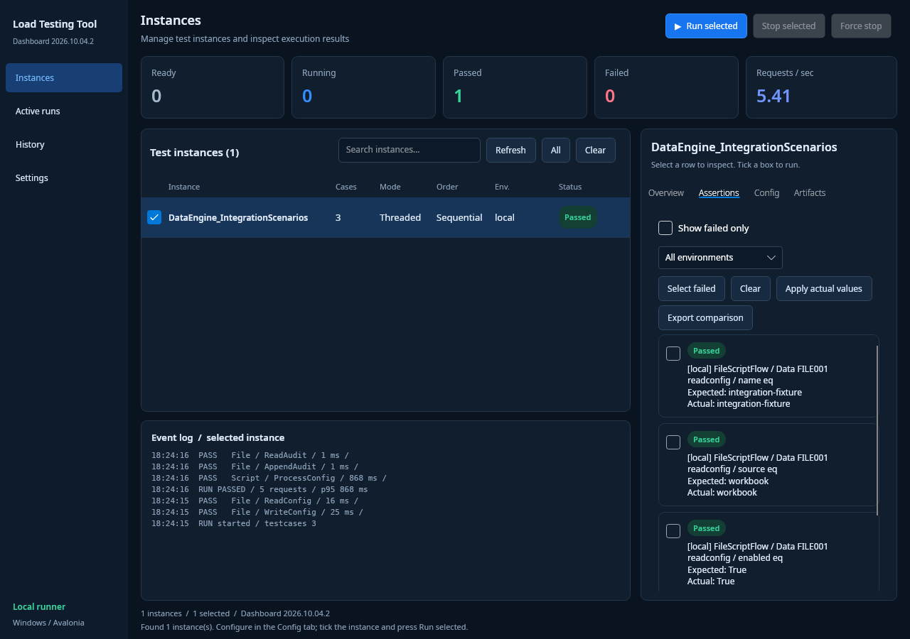

# Desktop Dashboard — Implementation and Verification

**Date:** 2026-10-04  
**Build identifier:** Dashboard 2026.10.04.2  
**Target package:** Windows x64, Release, self-contained

## What was wrong with the earlier delivery

The earlier UI changes were compiled and published, but the running interface had not been visually checked. A successful build did not prove that it matched the mockup.

Launching the earlier app revealed:

- Fixed-width configuration controls squeezed the instance name out of the row.
- A light main workspace contradicted the recommended dark reference.
- Default large tab typography caused wrapping and crowding.
- Sidebar entries were decorative Borders rather than navigation controls.
- Logs and Artifacts tabs only contained instructions.
- The requests/sec card always displayed a placeholder.
- Search had no filtering handler.

These were implementation/verification shortcomings, not evidence that the user had extracted the wrong build.

## Implemented corrections

### Visual structure

- Forced the Avalonia Dark theme with a consistent navy palette, compact typography, rounded cards, and styled actions.
- Added a compact instance table with aligned headers: Instance, Cases, Mode, Order, Environment, Status.
- Moved editable testcase indexes, execution mode, testcase order, environment selection, and data ID selection into **Config**.
- Kept instance selection distinct from run selection: clicking a row inspects it; ticking a checkbox selects it for run/stop commands.
- Made all details tabs compact and provided proper scrolling for long content.
- Added the visible build identifier in the sidebar and window title.

### Functional navigation

| Navigation | Behavior |
|---|---|
| Instances | Discover workbooks, search/filter, inspect and configure instances, select runs |
| Active runs | Show only instances whose runner processes are alive; automatically remove finished processes |
| History | List saved Excel workbooks from instance History and Results folders; open them with the configured spreadsheet application |
| Settings | Show resolved configuration paths, provide the internal-log switch and UI-log/manual actions; explain how to change path configuration |

### Run inspection

- Live Ready/Running/Passed/Failed counts.
- Requests/sec from the most recently completed run in this UI session, using the runner's aggregate metric.
- Real request count, average duration, p95 duration, assertions, status, and environment in Overview.
- Completed-step timeline with actual step names, types, durations, results, and structured failure categories.
- Latency trend of the most recent 30 observed request completions. This is a **latency chart**, not fabricated sampled throughput.
- Event log populated from actual runner events, capped to recent messages.
- Assertions rendered as readable wrapped cards, with existing filtering, selection, actual-value application, and comparison export functionality retained.
- Artifacts actions for workbooks, logs, templates, results, and assertion comparisons.
- Run/Stop/Force stop commands enabled according to selected-process state.

### Reliability and packaging fixes

- Fixed an NDJSON polling off-by-one error: the empty trailing line was being counted as consumed, causing the first newly appended record to be skipped on a later poll.
- Dispose each parsed JsonDocument after its event is applied.
- Normalize uppercase runner outcomes for UI counts and badges.
- Handle process exit while in Stopping state and distinguish cancelled outcomes.
- Locate internal logs in the instance Logs folder as well as Results/current-run folders.
- Fall back to the History folder when opening the latest result workbook.
- Resolve UI configuration and relative paths from the executable directory, not the caller's working directory.
- Configure the distributed UI to launch `../Runner/LoadTestingTool.exe` directly, so the self-contained runner does not depend on a system `dotnet` installation.
- Add a repeatable self-contained Windows packaging script, archive validation, runtime-file checks, and `BUILD_INFO.json` source metadata.
- Package the manual and original integration workbook with all required instance input assets.

**No complete-run timeout was added.** Runner/executor features unrelated to these UI corrections were not expanded.

## Runtime verification actually performed

The Avalonia application was launched on the Sandbox's Linux desktop, resized to **1280 × 900**, and driven using real mouse/keyboard events. This was not an HTML recreation or an AI-generated screenshot.

Testing used an isolated copy of the integration instance. Repository instance workbooks were not modified. A temporary localhost slow-HTTP testcase was added only to that test copy to exercise stop controls.

| Check | Observed result |
|---|---|
| Actual layout at 1280 × 900 | Instance name, headers, controls, compact tabs and dark palette render correctly |
| Config testcase selection | Setting index 3 appears in the row and in the actual runner launch arguments |
| Environment selection | Local environment appears in the row and runner arguments |
| FileScriptFlow run | Passed; five completed requests and four passing assertions |
| Event completeness after polling fix | Asserted that all **5/5** completed-request events reached the UI log |
| Dashboard metrics | Passed count, request count, p95 and requests/sec populate from real results |
| Search | Nonmatching query removes the row; clearing the query restores it |
| Assertions | Turning off failed-only displays actual passing assertion cards |
| Comparison export | Export created a readable workbook containing Comparison, FailedOnly, Differences and Summary sheets |
| Active runs | Slow local fixture appears while running and disappears after cancellation |
| Graceful stop | Stop selected signals the runner; cancelled aggregate event and result workbook produced |
| Force stop | Force stop terminates the selected local runner process; process no longer present |
| History navigation | Opens a populated saved-workbook page |
| Settings navigation | Opens resolved settings/logging page rather than remaining on Instances |
| Compilation | Solution build passed with zero errors |

Screenshots below are actual app captures. Their data and paths are from the isolated test environment.

### Dashboard



### Active runs



### History



### Settings



### Assertions



## Build and package reproduction

From the repository root on Linux with .NET 10, Python 3, zip and unzip installed:

```bash
./scripts/package-windows-dashboard.sh
```

The script publishes both apps with:

```bash
dotnet publish LoadTestingTool.csproj -c Release -r win-x64 --self-contained true
dotnet publish src/LoadTestingTool.UI/LoadTestingTool.UI.csproj -c Release -r win-x64 --self-contained true
```

Output:

```text
TSLoadTestingTool-Dashboard-2026.10.04.2-win-x64/
├── UI/
├── Runner/
├── Instances/
├── APPLICATION_GUIDE.pdf
├── BUILD_INFO.json
└── README.md
```

Extract the **entire** ZIP into a new folder and launch `UI/LoadTestingTool.UI.exe`. Verify the sidebar identifies **Dashboard 2026.10.04.2**. Do not copy only the EXE or mix this package with an old UI folder.

## Remaining limitations / later work

- Visual and interaction testing was performed using the native Linux Avalonia app. Windows binaries are cross-published and their archive/runtime/configuration layout is validated; **a Windows executable launch was not performed in the Sandbox**. Windows fonts and window decorations may differ slightly.
- The result is a working implementation of the dark dashboard design, not a pixel-identical copy of the AI-generated concept. Real data replaces the concept's illustrative instances and numbers.
- Settings path fields currently show resolved configuration; path edits are made in `UI/appsettings.json`, followed by restarting the app. They are not an in-app path editor.
- History opens saved workbooks; it does not yet replay every historical run into the live dashboard or persist all UI selections across restarts.
- Requests/sec is the completed-run aggregate, not instantaneous sampled throughput. The chart displays observed request durations instead.
- Timeline/event display follows UI-observed event delivery. Cross-file polling does not provide a globally timestamp-sorted distributed trace.
- Force stop may leave partial output; it cannot guarantee a graceful result workbook.
- The existing **NU1903 high-severity vulnerability warning for Tmds.DBus.Protocol 0.20.0** remains. Dependency upgrades require a separate compatibility check and were not hidden or claimed fixed.
- Windows spreadsheet/manual file opening depends on the configured local applications. Microsoft Excel itself was not available for testing in the Linux Sandbox.
